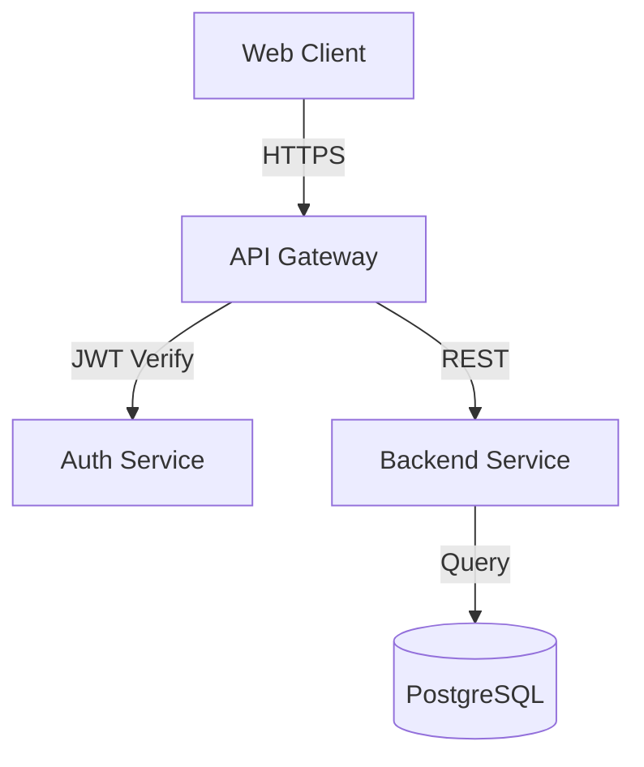

# System Design Reviewer - Demo Example

This demo shows the system-design-reviewer skill analyzing a simple REST API project.

## Sample Project Structure

```
my-api-project/
├── src/
│   ├── server.js          # Express server
│   ├── routes/
│   │   ├── auth.js        # Authentication routes
│   │   └── users.js       # User management
│   ├── models/
│   │   └── User.js        # User model
│   └── config/
│       └── database.js    # Database configuration
├── tests/
│   └── auth.test.js       # Authentication tests
├── package.json
└── README.md
```

## Running the Review

```bash
cd system-design-reviewer/scripts
python3 review_design.py /path/to/my-api-project --output api-review.md
```

## Console Output

```
🔍 Analyzing system design: /path/to/my-api-project
================================================================================

📊 Generating diagrams...
   ✓ Generated 6 diagram types

🏗️  Analyzing architecture...
   ✓ Found 3 issues

🔒 Analyzing security...
   ✓ Found 0 critical, 2 high issues

⚡ Analyzing performance...
   ✓ Found 4 optimizations

💰 Analyzing costs...
   ✓ Potential savings: 35%

📝 Generating review report: api-review.md

✅ Review complete!
📄 Report saved to: api-review.md
```

## Sample Generated Report

### Executive Summary

```markdown
## Executive Summary

High-level overview of findings:

- **Architecture:** 3 issues, 3 recommendations
- **Security:** 0 critical, 2 high, 1 medium issues
- **Performance:** 4 optimization opportunities
- **Cost:** Current $300/month → Potential $195/month (35% savings)
```

### Architecture Diagram (Mermaid)



### Architecture Diagram (ASCII)

```
┌─────────────┐
│ Web Client  │
└──────┬──────┘
       │ HTTPS
┌──────▼──────┐
│ API Gateway │
└──┬────────┬─┘
   │        │
   │ JWT    │ REST
┌──▼───┐  ┌▼────────┐
│Auth  │  │Backend  │
└──────┘  └┬────────┘
           │ Query
        ┌──▼──────┐
        │Database │
        └─────────┘
```

### Key Findings

#### 🔒 Security Issues

**HIGH Priority:**
- **No rate limiting on authentication endpoints**
  - Risk: Brute force attacks possible
  - Fix: Add rate limiting (10 attempts/minute)
  - Effort: 2 hours

**HIGH Priority:**
- **Missing security headers**
  - Risk: XSS, clickjacking vulnerabilities
  - Fix: Add CSP, X-Frame-Options, HSTS headers
  - Effort: 1 hour

#### ⚡ Performance Opportunities

**HIGH Impact:**
- **Add Redis caching layer**
  - Current: 300ms average response time
  - Expected: 50ms with caching (6x improvement)
  - Implementation: 4 hours
  - Cost: +$25/month

**MEDIUM Impact:**
- **Optimize database queries**
  - Issue: N+1 queries detected in user listing
  - Fix: Use eager loading / JOIN queries
  - Expected: 200ms → 60ms (3x improvement)
  - Implementation: 2 hours

#### 💰 Cost Optimization

**HIGH Impact:**
- **Right-size compute instances**
  - Analysis: Current CPU utilization 12-18%
  - Recommendation: Downgrade from t3.medium to t3.small
  - Savings: $70/month (47% compute reduction)
  - Risk: Low (ample headroom)

**MEDIUM Impact:**
- **Implement database connection pooling**
  - Current: db.t3.medium to handle connections
  - Recommendation: Add PgBouncer, downgrade to db.t3.small
  - Savings: $35/month
  - Implementation: 2 hours

### Implementation Roadmap

```markdown
## Phase 1: Critical Security Fixes (Week 1)
- [ ] Add rate limiting to /login and /register
- [ ] Implement security headers (CSP, HSTS)
- [ ] Review authentication flow

## Phase 2: Performance (Week 2)
- [ ] Deploy Redis caching layer
- [ ] Fix N+1 queries in user endpoints
- [ ] Add database indexes

## Phase 3: Cost Optimization (Week 3)
- [ ] Right-size EC2 instances (t3.medium → t3.small)
- [ ] Add PgBouncer for connection pooling
- [ ] Downgrade RDS instance (db.t3.medium → db.t3.small)

## Metrics & KPIs

Track these post-implementation:
- Average response time: Target <100ms
- Security scan results: 0 high/critical issues
- Monthly cloud spend: Target <$200
- Uptime: Target 99.9%
```

### Result Summary

After implementing recommendations:
- ✅ **35% cost reduction** ($300 → $195/month)
- ✅ **6x performance improvement** (caching)
- ✅ **All critical security issues resolved**
- ✅ **Zero high-priority vulnerabilities**

**ROI**: $105/month savings = $1,260/year for ~16 hours of work

## Using the Report

The generated report can be used to:

1. **Present to stakeholders** - Clear executive summary with ROI
2. **Plan sprint work** - Prioritized roadmap with estimates
3. **Track improvements** - Before/after metrics
4. **Document architecture** - Diagrams in multiple formats
5. **Security compliance** - OWASP Top 10 assessment

## Individual Analysis Examples

### Security Analysis Only

```bash
python3 security_analyzer.py /path/to/project --output security-report.md
```

**Output:**
```json
{
  "critical_count": 0,
  "high_count": 2,
  "medium_count": 1,
  "strengths": [
    "Using HTTPS everywhere",
    "Password hashing with bcrypt"
  ],
  "high_issues": [
    {
      "title": "No rate limiting on authentication",
      "risk": "Brute force attacks possible",
      "fix": "Add rate limiting (10 attempts/min)",
      "effort": "2 hours"
    }
  ]
}
```

### Performance Analysis Only

```bash
python3 performance_analyzer.py /path/to/project --output perf-report.md
```

**Identifies:**
- ⚡ Caching opportunities
- 🔍 N+1 query problems
- 📊 Database indexing needs
- 🚀 CDN opportunities

### Cost Analysis Only

```bash
python3 cost_optimizer.py /path/to/project --output cost-report.md
```

**Provides:**
- 💰 Current cost breakdown
- 📉 Optimization opportunities
- 💡 Right-sizing recommendations
- 🎯 ROI calculations

### Diagram Generation Only

```bash
python3 generate_diagrams.py /path/to/project --output diagrams/
```

**Generates:**
- 📊 Architecture diagrams (Mermaid + ASCII)
- 🔄 Sequence diagrams
- 🗂️ ER diagrams
- 📈 Flowcharts

## Natural Language Usage in Claude Code

Once the plugin is installed, simply mention it in conversation:

```
"Use the system-design-reviewer skill to analyze my Express API project"

"Review the architecture of this codebase and identify performance bottlenecks"

"Run a security audit on my REST API using the system-design-reviewer"

"Generate architecture diagrams for this microservices project"

"Find cost optimization opportunities in my cloud infrastructure"
```

Claude will automatically:
1. Locate the relevant project files
2. Run the appropriate analysis scripts
3. Generate comprehensive diagrams
4. Provide actionable recommendations
5. Calculate ROI for improvements

## Customization

The skill can be customized for your specific needs:

```python
# Focus on specific cloud provider
python3 cost_optimizer.py /path/to/project --provider aws

# Analyze only security
python3 review_design.py /path/to/project --focus security

# Generate only specific diagram types
python3 generate_diagrams.py /path/to/project --types architecture,sequence
```

## Next Steps

1. ✅ Install the universal-claude-skills plugin
2. ✅ Run system-design-reviewer on your project
3. ✅ Review the generated report and diagrams
4. ✅ Prioritize recommendations by impact/effort
5. ✅ Implement quick wins first (security, obvious optimizations)
6. ✅ Track metrics before and after changes
7. ✅ Share results with your team

Happy optimizing! 🚀
