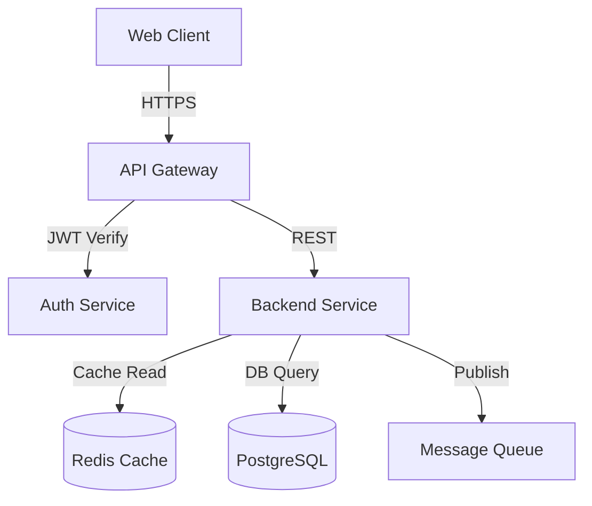
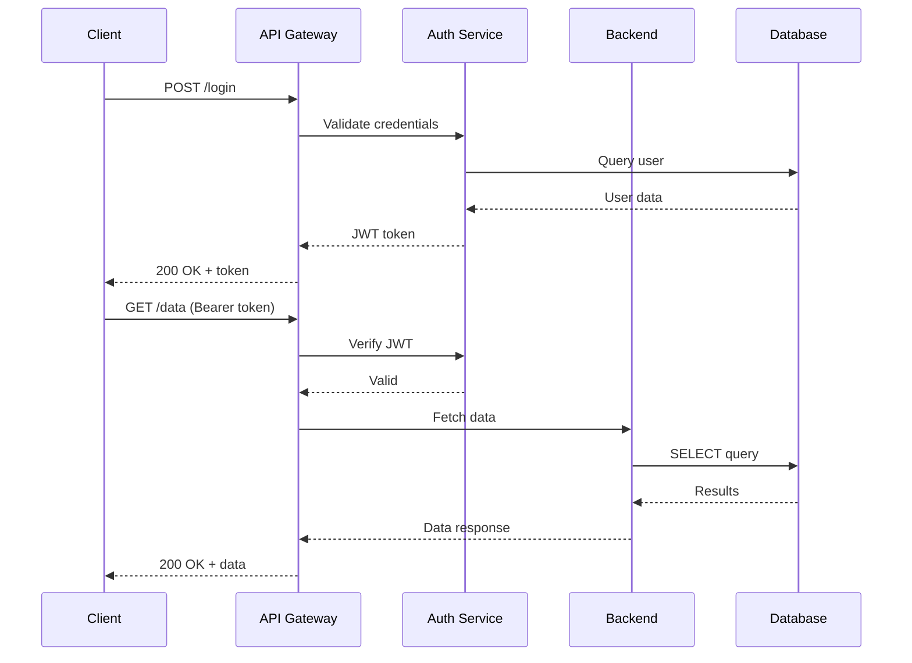
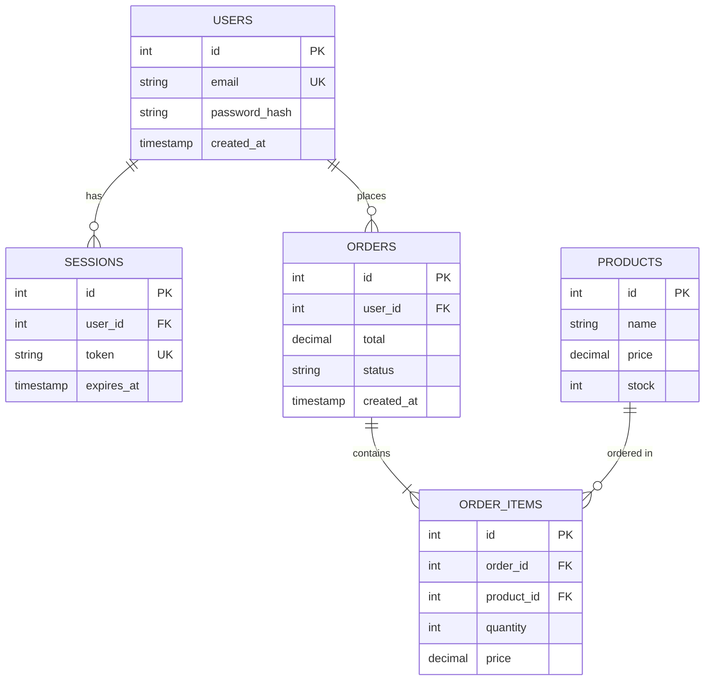
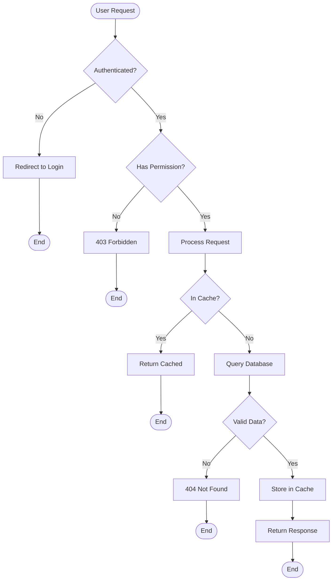

# System Design Reviewer

Review existing system designs and generate comprehensive text diagrams in multiple formats (Mermaid + ASCII) with detailed analysis across architecture, security, performance, and cost optimization.

## Overview

Transform system designs into:
- **Multi-format diagrams** - Mermaid (renderable) + ASCII (universal)
- **Architecture review** - Scalability, reliability, maintainability analysis
- **Security assessment** - Auth, encryption, vulnerability detection
- **Performance optimization** - Caching, load balancing, query analysis
- **Cost efficiency** - Resource optimization, cloud cost reduction

## Basic Workflow

### 1. Gather Design Information

Collect existing system design materials:
```
Input sources:
- Source code (APIs, services, database models)
- Documentation (architecture docs, API specs)
- Infrastructure config (Docker, K8s, Terraform)
- Database schemas (SQL, migrations)
```

Run analysis:
```bash
cd system-design-reviewer/scripts
python3 review_design.py /path/to/project --output review-report.md
```

### 2. Review Generated Diagrams

Receive multi-format diagrams:
- **Architecture diagrams** - Components, services, databases, external APIs
- **Sequence diagrams** - API flows, user interactions, authentication flows
- **Database/ER diagrams** - Schema relationships, foreign keys, indexes
- **Flowcharts** - Decision trees, business logic flows

Each diagram in dual format:
- **Mermaid** - Rich, renderable in GitHub/GitLab/Markdown viewers
- **ASCII** - Universal compatibility for terminal/plain text

### 3. Review Analysis Findings

Review comprehensive analysis across:
- **Architecture** - Pattern recommendations, bottleneck identification
- **Security** - OWASP compliance, auth/encryption gaps
- **Performance** - Query optimization, caching strategies
- **Cost** - Resource rightsizing, serverless opportunities

### 4. Implement Recommendations

Act on findings:
- High-priority security fixes
- Performance optimizations
- Architecture refactoring
- Cost reduction strategies

## Diagram Generation

### Architecture Diagrams

Show system components and relationships:

**Mermaid Format:**


**ASCII Format:**
```
┌─────────────┐
│ Web Client  │
└──────┬──────┘
       │ HTTPS
┌──────▼──────┐
│ API Gateway │
└──┬────────┬─┘
   │        │
   │ JWT    │ REST
┌──▼───┐  ┌▼────────┐
│Auth  │  │Backend  │
└──────┘  └┬───────┬┘
           │       │
    Cache  │       │ DB Query
     ┌─────▼┐   ┌─▼──────┐
     │Redis │   │Postgres│
     └──────┘   └────────┘
```

### Sequence Diagrams

Show API interaction flows:

**Mermaid Format:**


**ASCII Format:**
```
Client    API      Auth     Backend    DB
  │       │         │         │        │
  ├──POST /login───>│         │        │
  │       ├─validate─────>│   │        │
  │       │         ├─query──────────>│
  │       │         │<──data───────────┤
  │       │<──JWT───┤         │        │
  │<──200 OK + token┤         │        │
  │       │         │         │        │
  ├──GET /data─────>│         │        │
  │       ├─verify───────>│   │        │
  │       │<──valid──────┤    │        │
  │       ├─fetch data────────>│       │
  │       │         │     ├─SELECT────>│
  │       │         │     │<──results──┤
  │       │<──response────┤    │       │
  │<──200 OK + data┤      │    │       │
```

### Database/ER Diagrams

Show schema relationships:

**Mermaid Format:**


**ASCII Format:**
```
┌─────────────────┐
│     USERS       │
├─────────────────┤
│ id (PK)         │
│ email (UK)      │
│ password_hash   │
│ created_at      │
└────────┬────────┘
         │ 1:N
         │
┌────────▼────────┐     ┌──────────────┐
│    SESSIONS     │     │    ORDERS    │
├─────────────────┤     ├──────────────┤
│ id (PK)         │     │ id (PK)      │
│ user_id (FK)    │     │ user_id (FK) │
│ token (UK)      │     │ total        │
│ expires_at      │     │ status       │
└─────────────────┘     └──────┬───────┘
                              │ 1:N
                              │
                    ┌─────────▼────────┐
                    │   ORDER_ITEMS    │
                    ├──────────────────┤
                    │ id (PK)          │
                    │ order_id (FK)    │
                    │ product_id (FK)  │
                    │ quantity         │
                    │ price            │
                    └──────────────────┘
                              │ N:1
                              │
                    ┌─────────▼────────┐
                    │    PRODUCTS      │
                    ├──────────────────┤
                    │ id (PK)          │
                    │ name             │
                    │ price            │
                    │ stock            │
                    └──────────────────┘
```

### Flowcharts

Show business logic and decision flows:

**Mermaid Format:**


**ASCII Format:**
```
[User Request]
      │
      ▼
  ┌───────────┐
  │Authenticated?│
  └─┬────────┬─┘
    │ No     │ Yes
    ▼        ▼
[Login]  ┌──────────┐
         │Permission?│
         └─┬──────┬─┘
           │ No   │ Yes
           ▼      ▼
        [403] [Process]
                  │
              ┌───▼────┐
              │Cached? │
              └┬──────┬┘
          Yes  │      │ No
               ▼      ▼
          [Return] [Query DB]
                      │
                  ┌───▼────┐
                  │Valid?  │
                  └┬──────┬┘
              No   │      │ Yes
                   ▼      ▼
                [404]  [Cache & Return]
```

## Review Framework

### Architecture Analysis

Check for:

**Scalability:**
- [ ] Horizontal scaling capability
- [ ] Stateless services (session externalization)
- [ ] Load balancing strategy
- [ ] Database sharding/partitioning plan
- [ ] Async processing for heavy tasks
- [ ] Rate limiting and throttling

**Reliability:**
- [ ] Single point of failure elimination
- [ ] Circuit breakers for external dependencies
- [ ] Retry logic with exponential backoff
- [ ] Health check endpoints
- [ ] Graceful degradation
- [ ] Database replication/backups

**Maintainability:**
- [ ] Service separation and loose coupling
- [ ] Clear API contracts
- [ ] Versioning strategy
- [ ] Logging and observability
- [ ] Documentation completeness
- [ ] Code organization and modularity

### Security Analysis

Check for:

**Authentication & Authorization:**
- [ ] Strong authentication mechanism (JWT, OAuth)
- [ ] Password hashing (bcrypt/argon2)
- [ ] Session management security
- [ ] Role-based access control (RBAC)
- [ ] API key management
- [ ] Multi-factor authentication (MFA)

**Data Protection:**
- [ ] Encryption at rest (database, files)
- [ ] Encryption in transit (TLS/HTTPS)
- [ ] Sensitive data masking in logs
- [ ] PII data handling compliance
- [ ] Secure key storage (env vars, vaults)
- [ ] Data retention policies

**Vulnerability Prevention:**
- [ ] SQL injection protection (parameterized queries)
- [ ] XSS prevention (input sanitization)
- [ ] CSRF protection (tokens)
- [ ] Input validation on all endpoints
- [ ] Output encoding
- [ ] Security headers (CSP, HSTS, etc.)
- [ ] Dependency vulnerability scanning
- [ ] API rate limiting

### Performance Analysis

Check for:

**Caching Strategy:**
- [ ] Application-level caching (Redis/Memcached)
- [ ] Database query caching
- [ ] CDN for static assets
- [ ] HTTP caching headers
- [ ] Cache invalidation strategy
- [ ] Cache hit rate monitoring

**Database Optimization:**
- [ ] Proper indexing on query columns
- [ ] N+1 query elimination
- [ ] Connection pooling
- [ ] Query optimization (EXPLAIN analysis)
- [ ] Database denormalization where appropriate
- [ ] Read replicas for read-heavy workloads

**Load Management:**
- [ ] Load balancer configuration
- [ ] Auto-scaling policies
- [ ] Connection limits
- [ ] Request timeouts
- [ ] Async/background job processing
- [ ] Message queue implementation

### Cost Optimization

Check for:

**Resource Efficiency:**
- [ ] Right-sized compute instances
- [ ] Auto-scaling to match demand
- [ ] Spot/preemptible instances for non-critical workloads
- [ ] Reserved instances for predictable workloads
- [ ] Idle resource identification
- [ ] Resource utilization monitoring

**Architecture Optimization:**
- [ ] Serverless opportunities (Lambda/Cloud Functions)
- [ ] Static site hosting for frontends
- [ ] Edge caching (CloudFront/CDN)
- [ ] Database connection pooling
- [ ] Storage tiering (hot/cold data)
- [ ] Log retention optimization

**Cost Monitoring:**
- [ ] Cost allocation tags
- [ ] Budget alerts
- [ ] Cost per request tracking
- [ ] Unused resource cleanup
- [ ] Cross-region data transfer optimization
- [ ] API call cost optimization

## Output Format

### Complete Review Report

```markdown
# System Design Review Report
**Project:** [Project Name]
**Review Date:** [Date]
**Reviewer:** [Name/Tool]

---

## Executive Summary

High-level overview of findings:
- **Architecture:** X issues, Y recommendations
- **Security:** A critical, B high, C medium issues
- **Performance:** P optimization opportunities
- **Cost:** Current $X/month → Potential $Y/month (Z% savings)

---

## System Diagrams

### Architecture Overview (Mermaid)
```mermaid
[Generated diagram]
```

### Architecture Overview (ASCII)
```
[Generated diagram]
```

### Authentication Flow (Mermaid)
```mermaid
[Generated sequence diagram]
```

### Database Schema (Mermaid)
```mermaid
[Generated ER diagram]
```

---

## Architecture Review

### ✅ Strengths
- Well-separated microservices
- Proper use of message queues
- Good database normalization

### ⚠️ Issues & Recommendations

#### HIGH Priority
**Issue:** Single database instance is single point of failure
- **Impact:** System downtime if database fails
- **Recommendation:** Implement PostgreSQL replication (primary + 2 replicas)
- **Effort:** 4 hours
- **Cost Impact:** +$50/month

#### MEDIUM Priority
**Issue:** No caching layer
- **Impact:** High database load, slow response times
- **Recommendation:** Add Redis cache for frequently accessed data
- **Effort:** 6 hours
- **Cost Impact:** +$30/month, reduces DB cost by $20/month

---

## Security Review

### ✅ Strengths
- Using bcrypt for password hashing
- HTTPS everywhere
- Input validation on API endpoints

### 🚨 Critical Issues
**CRITICAL:** API keys hardcoded in source code
- **File:** `config/api_keys.py`
- **Risk:** Key exposure in version control
- **Fix:** Move to environment variables + secret management
- **Effort:** 1 hour

### ⚠️ High Priority Issues
**HIGH:** No rate limiting on authentication endpoints
- **Risk:** Brute force attacks possible
- **Fix:** Add rate limiting (10 attempts/minute)
- **Effort:** 2 hours

### 📋 Medium Priority Issues
**MEDIUM:** Missing security headers
- **Risk:** XSS, clickjacking vulnerabilities
- **Fix:** Add CSP, X-Frame-Options, HSTS headers
- **Effort:** 1 hour

---

## Performance Review

### ✅ Strengths
- Async processing for email sending
- Connection pooling configured
- Proper indexes on user table

### ⚠️ Optimization Opportunities

#### HIGH Impact
**Opportunity:** Add Redis caching
- **Current:** 500ms average response time
- **Expected:** 50ms with caching (10x improvement)
- **Implementation:** 6 hours
- **Cost:** +$30/month

#### MEDIUM Impact
**Opportunity:** Optimize database queries
- **Issue:** N+1 queries in order listing (detected 15 queries per request)
- **Fix:** Use eager loading / JOIN queries
- **Expected:** 200ms → 50ms (4x improvement)
- **Implementation:** 3 hours

#### LOW Impact
**Opportunity:** CDN for static assets
- **Current:** Serving from application server
- **Expected:** 30% faster asset loading
- **Implementation:** 2 hours
- **Cost:** +$10/month

---

## Cost Optimization

### Current Monthly Cost: $450

**Breakdown:**
- Compute: $200 (2x t3.medium instances)
- Database: $150 (db.t3.large)
- Storage: $50 (500GB)
- Network: $30
- Other: $20

### Optimization Opportunities

#### HIGH Impact
**Opportunity:** Right-size compute instances
- **Analysis:** Current CPU utilization 15-20%
- **Recommendation:** Downgrade to t3.small
- **Savings:** $100/month (50% reduction)
- **Risk:** Low (ample headroom)

#### MEDIUM Impact
**Opportunity:** Implement database connection pooling
- **Current:** db.t3.large to handle connection overhead
- **Recommendation:** Add PgBouncer, downgrade to db.t3.medium
- **Savings:** $50/month
- **Implementation:** 3 hours

#### LOW Impact
**Opportunity:** S3 lifecycle policies
- **Current:** All logs in standard storage
- **Recommendation:** Move logs >30 days to Glacier
- **Savings:** $15/month
- **Implementation:** 1 hour

### Optimized Monthly Cost: $285 (37% reduction)

---

## Implementation Roadmap

### Phase 1: Critical Fixes (Week 1)
- [ ] Move API keys to environment variables
- [ ] Add rate limiting to auth endpoints
- [ ] Implement database replication

### Phase 2: Performance (Week 2)
- [ ] Deploy Redis caching
- [ ] Fix N+1 queries
- [ ] Add CDN for static assets

### Phase 3: Cost Optimization (Week 3)
- [ ] Right-size compute instances
- [ ] Add connection pooling
- [ ] Configure S3 lifecycle policies

### Phase 4: Enhancements (Week 4)
- [ ] Add security headers
- [ ] Implement monitoring dashboards
- [ ] Documentation updates

---

## Metrics & KPIs

Track these metrics post-implementation:

**Performance:**
- Average response time (target: <100ms)
- p95 response time (target: <500ms)
- Cache hit rate (target: >70%)
- Database query time (target: <50ms)

**Security:**
- Failed login attempts
- Rate limit hits
- Security scan results (0 high/critical)

**Cost:**
- Monthly cloud spend (target: <$300)
- Cost per 1000 requests
- Resource utilization (target: 60-80%)

**Reliability:**
- Uptime percentage (target: 99.9%)
- Error rate (target: <0.1%)
- Mean time to recovery (target: <15min)

---

## Conclusion

The system has a solid foundation but has opportunities for improvement across security, performance, and cost efficiency. Implementing the recommended changes will result in:

- **37% cost reduction** ($450 → $285/month)
- **5-10x performance improvement** (caching + query optimization)
- **Elimination of critical security vulnerabilities**
- **Improved reliability** (database replication)

**Estimated total implementation effort:** 30 hours over 4 weeks

**ROI:** $165/month savings = $1,980/year for 30 hours of work
```

## Usage Examples

### Example 1: Review API Service

✅ **DO**: Analyze complete service structure
```bash
# Review entire microservice
python3 scripts/review_design.py /path/to/api-service \
  --output docs/design-review.md \
  --diagrams docs/diagrams/ \
  --format both  # Mermaid + ASCII
```

Output:
- Architecture diagram showing API, database, cache
- Sequence diagram for authentication flow
- Database ER diagram
- Security findings (3 critical issues)
- Performance recommendations (caching strategy)
- Cost optimization (right-size instances)

❌ **DON'T**: Review without context
```bash
# Missing project context and output path
python3 scripts/review_design.py .
```

### Example 2: Focus on Security

✅ **DO**: Run targeted security analysis
```bash
# Security-focused review
python3 scripts/security_analyzer.py /path/to/project \
  --output security-report.md \
  --check owasp-top10 \
  --scan-secrets \
  --verify-encryption
```

Output:
- OWASP Top 10 compliance check
- Hardcoded secret detection
- Encryption verification (data at rest/transit)
- Authentication mechanism review
- Authorization gaps

❌ **DON'T**: Skip critical security checks
```bash
# Incomplete security review
python3 scripts/security_analyzer.py /path/to/project
```

### Example 3: Performance Optimization

✅ **DO**: Comprehensive performance analysis
```bash
# Performance-focused review
python3 scripts/performance_analyzer.py /path/to/project \
  --output perf-report.md \
  --analyze-queries \
  --check-caching \
  --load-patterns metrics.json
```

Output:
- Database query analysis (N+1 detection)
- Caching opportunities
- Load balancing recommendations
- Async processing suggestions
- Response time optimization

❌ **DON'T**: Ignore actual usage patterns
```bash
# No metrics provided
python3 scripts/performance_analyzer.py /path/to/project
```

## Advanced Features

### Automated Diagram Generation

Generate all diagrams from source code:
```bash
python3 scripts/generate_diagrams.py /path/to/project \
  --output diagrams/ \
  --formats mermaid,ascii \
  --types architecture,sequence,er,flowchart
```

### Cost Analysis

Detailed cloud cost breakdown:
```bash
python3 scripts/cost_optimizer.py /path/to/project \
  --provider aws \
  --current-config infra/terraform \
  --usage-metrics metrics.json \
  --output cost-optimization.md
```

### Batch Review

Review multiple services:
```bash
# Review all microservices
for service in services/*; do
  python3 scripts/review_design.py "$service" \
    --output "reviews/$(basename $service)-review.md"
done
```

### Integration with CI/CD

Add to GitHub Actions:
```yaml
- name: System Design Review
  run: |
    python3 system-design-reviewer/scripts/review_design.py . \
      --output design-review.md \
      --fail-on-critical \
      --comment-on-pr
```

## Best Practices

### Diagram Creation

✅ **DO**: Include all critical components
```
Components to show:
- External clients (web, mobile)
- API gateways / load balancers
- Application services
- Databases and caches
- Message queues
- External APIs
- Monitoring systems
```

❌ **DON'T**: Oversimplify or over-complicate
```
Too simple: Just "Frontend -> Backend -> Database"
Too complex: Every single function call and variable
```

### Security Review

✅ **DO**: Check authentication flows thoroughly
```
Authentication review checklist:
- [ ] Password storage (bcrypt/argon2)
- [ ] Token generation (secure random)
- [ ] Token expiration and refresh
- [ ] Session management
- [ ] MFA implementation
- [ ] Account lockout mechanism
```

❌ **DON'T**: Assume security is adequate
```
Bad: "Uses HTTPS so it's secure"
Good: Verify TLS version, cipher suites, cert validation
```

### Performance Review

✅ **DO**: Analyze with real metrics
```
Use actual data:
- Response time percentiles (p50, p95, p99)
- Database query execution times
- Cache hit rates
- Error rates under load
```

❌ **DON'T**: Make assumptions without data
```
Bad: "This should be fast enough"
Good: "Current p95 is 500ms, target is <100ms"
```

### Cost Review

✅ **DO**: Calculate ROI for optimizations
```
Cost optimization with ROI:
- Current cost: $450/month
- Optimization cost: 30 hours @ $100/hr = $3000
- New cost: $285/month
- Savings: $165/month = $1980/year
- Payback: 1.5 months
```

❌ **DON'T**: Optimize prematurely without analysis
```
Bad: "Let's use serverless everywhere"
Good: Analyze workload patterns, then decide
```

## Quality Checklist

Before finalizing review:

**Diagrams:**
- [ ] All major components included
- [ ] Both Mermaid and ASCII formats generated
- [ ] Relationships clearly shown
- [ ] External dependencies identified
- [ ] Data flows indicated

**Architecture Review:**
- [ ] Scalability assessment complete
- [ ] Reliability issues identified
- [ ] Maintainability evaluated
- [ ] Recommendations prioritized
- [ ] Implementation effort estimated

**Security Review:**
- [ ] Authentication mechanism reviewed
- [ ] Data encryption verified
- [ ] OWASP Top 10 checked
- [ ] Hardcoded secrets scanned
- [ ] Access control evaluated

**Performance Review:**
- [ ] Database queries analyzed
- [ ] Caching opportunities identified
- [ ] Load balancing reviewed
- [ ] Async processing evaluated
- [ ] Metrics-based analysis

**Cost Review:**
- [ ] Current cost breakdown
- [ ] Optimization opportunities identified
- [ ] Savings calculated
- [ ] ROI computed
- [ ] Risk assessment included

**Report Quality:**
- [ ] Executive summary clear
- [ ] Findings prioritized
- [ ] Implementation roadmap provided
- [ ] Metrics/KPIs defined
- [ ] Conclusion actionable

## Resources

- Architecture best practices: `references/architecture-best-practices.md`
- Security checklist: `references/security-checklist.md`
- Performance patterns: `references/performance-patterns.md`
- Cost optimization guide: `references/cost-optimization.md`
- Diagram examples: `references/diagram-examples.md`
- Review templates: `templates/review-report.md`
- Example reviews: `examples/before-review/` and `examples/after-review/`
- Scripts: `scripts/review_design.py`, `scripts/generate_diagrams.py`
