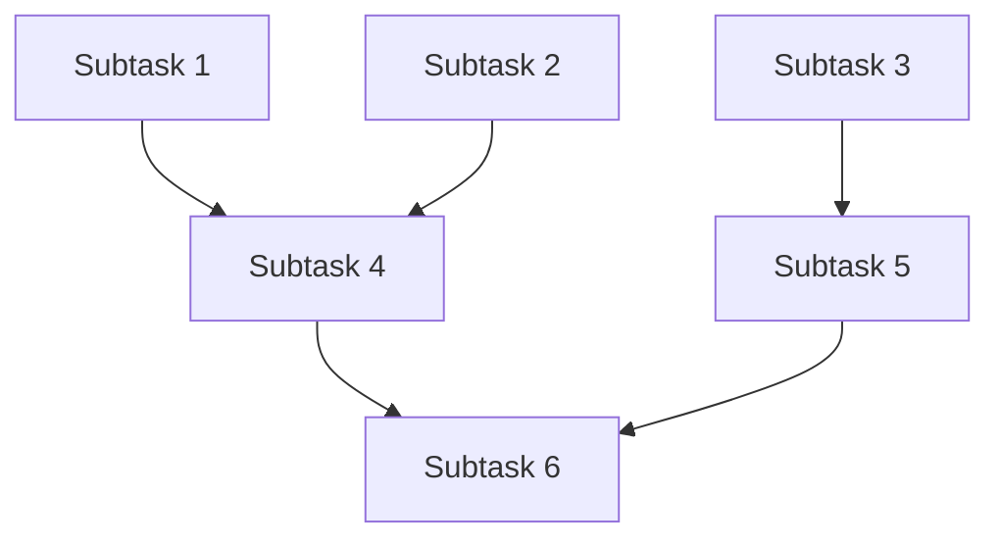

# Output Templates

Standard templates for task decomposition outputs optimized for Linear, GitHub, and other project management tools.

## Linear Issue Template

```markdown
# [Task Title]

## Description
[2-3 sentence description of what needs to be done]

## Context
**As-Is:** [Current state]
**To-Be:** [Desired state]
**Why:** [Rationale for this task]

## Acceptance Criteria
- [ ] [Specific deliverable 1]
- [ ] [Functional requirement 1]
- [ ] [Quality requirement 1]
- [ ] [Documentation requirement]

## Testing Checklist
- [ ] [Unit test scenario]
- [ ] [Integration test scenario]
- [ ] [Edge case handling]
- [ ] [Performance verification]

## Expected Outputs
- `path/to/file1.ext` - [Description]
- `path/to/file2.ext` - [Description]
- Documentation in [location]

## Dependencies
- Blocked by: [ISSUE-123, ISSUE-456]
- Blocks: [ISSUE-789]

## Risks
- **[LEVEL]**: [Description] → Mitigation: [Plan]

## Estimate
[X] hours

## Labels
`backend`, `api`, `security`

## Assignee
[Team member or @mention]
```

## GitHub Issue Template

```markdown
## 📋 Summary
[Brief description of the task]

## 🎯 Goals
- [Primary objective]
- [Secondary objective]

## 📝 Detailed Description
[Comprehensive description with context]

### Current State (As-Is)
- [What exists now]
- [Current limitations]

### Desired State (To-Be)
- [Target functionality]
- [Expected improvements]

## ✅ Acceptance Criteria
- [ ] [Criterion 1]
- [ ] [Criterion 2]
- [ ] [Criterion 3]

## 🧪 Testing
- [ ] Unit tests written and passing
- [ ] Integration tests covering main flows
- [ ] Edge cases handled
- [ ] Performance benchmarks met

## 📦 Deliverables
1. [File or artifact 1]
2. [File or artifact 2]
3. [Documentation updates]

## 🔗 Dependencies
**Blocked by:**
- #123 - [Description]

**Blocks:**
- #456 - [Description]

## ⚠️ Risks
| Level | Description | Mitigation |
|-------|-------------|------------|
| HIGH | [Risk description] | [Plan] |
| MEDIUM | [Risk description] | [Plan] |

## ⏱️ Estimate
**Time:** [X] hours
**Priority:** [P0/P1/P2]

## 📎 Additional Context
- [Link to related docs]
- [Screenshots if applicable]
- [References]

## 🏷️ Labels
`enhancement`, `backend`, `security`, `p0`

## 👤 Assignees
@username
```

## Jira Ticket Template

```
Summary: [Brief title]

Description:
h2. Overview
[Task description]

h2. Current State
* [As-is state]
* [Limitations]

h2. Target State
* [To-be state]
* [Improvements]

h2. Acceptance Criteria
* [Criterion 1]
* [Criterion 2]
* [Criterion 3]

h2. Testing Requirements
* Unit tests (>80% coverage)
* Integration tests
* Edge case validation

h2. Deliverables
* {{path/to/file1}}
* {{path/to/file2}}
* Documentation

h2. Risks
| Risk Level | Description | Mitigation |
| HIGH | [Description] | [Plan] |

Story Points: [X]
Priority: [Highest/High/Medium/Low]
Labels: backend, api, security
```

## Notion Task Template

```markdown
# [Task Title]

**Status:** 📋 To Do
**Priority:** 🔴 P0 / 🟠 P1 / 🟢 P2
**Estimate:** [X] hours
**Assignee:** @[name]

---

## 📖 Description
[Detailed task description]

## 🎯 Context

| Aspect | Details |
|--------|---------|
| **As-Is** | [Current state] |
| **To-Be** | [Desired state] |
| **Rationale** | [Why this task] |

## ✅ Acceptance Criteria
- [ ] [Criterion 1]
- [ ] [Criterion 2]
- [ ] [Criterion 3]
- [ ] [Testing complete]
- [ ] [Documentation updated]

## 🧪 Testing Checklist
- [ ] Unit tests written
- [ ] Integration tests passing
- [ ] Edge cases covered
- [ ] Performance validated

## 📦 Expected Outputs
1. **File:** `path/to/file` - [Description]
2. **Documentation:** [Location]
3. **Tests:** [Coverage target]

## 🔗 Dependencies

**⬅️ Blocked By:**
- [[Task 1]]
- [[Task 2]]

**➡️ Blocks:**
- [[Task 3]]

## ⚠️ Risks

| Level | Risk | Impact | Mitigation |
|-------|------|--------|------------|
| 🔴 HIGH | [Risk] | [Impact] | [Plan] |
| 🟠 MEDIUM | [Risk] | [Impact] | [Plan] |

## 📎 Resources
- [Link 1]
- [Link 2]

## 💬 Notes
[Any additional context]

**Tags:** #backend #api #security
```

## Asana Task Template

```
Task Name: [Title]

Description:
🎯 OBJECTIVE
[What needs to be accomplished]

📋 CURRENT STATE
• [As-is state]
• [Existing limitations]

✨ TARGET STATE
• [To-be state]
• [Expected improvements]

✅ ACCEPTANCE CRITERIA
☐ [Criterion 1]
☐ [Criterion 2]
☐ [Criterion 3]
☐ Tests written and passing
☐ Documentation updated

🧪 TESTING
☐ Unit tests (>80% coverage)
☐ Integration tests
☐ Edge cases validated

📦 DELIVERABLES
1. path/to/file1 - [Description]
2. path/to/file2 - [Description]
3. Updated documentation

⚠️ RISKS
• HIGH: [Description] → [Mitigation]
• MEDIUM: [Description] → [Mitigation]

🔗 DEPENDENCIES
Blocked by: [Task links]
Blocks: [Task links]

Due Date: [Date]
Estimate: [X] hours
Priority: High/Medium/Low
Tags: backend, api, security
```

## Markdown Decomposition Report

```markdown
# Task Decomposition Report

**Generated:** [Date]
**Original Task:** [Task description]
**Estimated Total Time:** [X] hours
**Number of Subtasks:** [N]

---

## Executive Summary

[High-level overview of the decomposition]

## Rationale

### Why This Breakdown?
[Explanation of decomposition logic]

### Key Principles
- [Principle 1]
- [Principle 2]
- [Principle 3]

## State Analysis

### As-Is (Current State)
- [Current situation]
- [Existing limitations]
- [Pain points]

### To-Be (Desired State)
- [Target functionality]
- [Expected improvements]
- [Success criteria]

### Gap Analysis
| Current | Gap | Required |
|---------|-----|----------|
| [State] | [Missing] | [Need] |

---

## Subtask Breakdown

### 1. [Subtask Title]
**Priority:** P0 (Critical Path)
**Estimate:** 2 hours
**Labels:** backend, database
**Dependencies:** None

**Description:**
[Detailed description]

**Acceptance Criteria:**
- [ ] [Criterion 1]
- [ ] [Criterion 2]

**Testing:**
- [ ] [Test 1]
- [ ] [Test 2]

**Expected Outputs:**
- `file1.ext` - [Description]
- Documentation

**Risks:**
- None

---

### 2. [Subtask Title]
[Same structure as above]

---

## Dependency Map



## Risk Matrix

| Level | Risk | Impact | Probability | Mitigation | Owner |
|-------|------|--------|-------------|------------|-------|
| HIGH | [Risk] | [Impact] | [Prob] | [Plan] | [Team] |
| MEDIUM | [Risk] | [Impact] | [Prob] | [Plan] | [Team] |
| LOW | [Risk] | [Impact] | [Prob] | [Plan] | [Team] |

## Timeline Estimate

| Phase | Subtasks | Duration | Dependencies |
|-------|----------|----------|--------------|
| Phase 1 | #1-3 | 6h | None |
| Phase 2 | #4-5 | 8h | Phase 1 |
| Phase 3 | #6-7 | 5h | Phase 2 |

**Total Estimated Time:** [X] hours
**Parallel Work Possible:** Yes/No
**Critical Path:** Subtasks [#1, #4, #6]

## Recommendations

1. [Recommendation 1]
2. [Recommendation 2]
3. [Recommendation 3]

## Next Steps

1. [ ] Review and approve decomposition
2. [ ] Create issues in project management tool
3. [ ] Assign subtasks to team members
4. [ ] Schedule kickoff meeting
5. [ ] Begin Phase 1 work
```

## JSON Format

```json
{
  "task": "[Task description]",
  "generated": "2025-01-06T10:00:00Z",
  "total_estimate_hours": 20,
  "rationale": "[Decomposition rationale]",
  "state_analysis": {
    "as_is": "[Current state]",
    "to_be": "[Desired state]",
    "gap_analysis": "[Gap description]"
  },
  "subtasks": [
    {
      "id": 1,
      "title": "[Subtask title]",
      "description": "[Description]",
      "priority": "P0",
      "estimate_hours": 2,
      "labels": ["backend", "database"],
      "dependencies": [],
      "acceptance_criteria": [
        "[Criterion 1]",
        "[Criterion 2]"
      ],
      "testing_criteria": [
        "[Test 1]",
        "[Test 2]"
      ],
      "expected_outputs": [
        {
          "path": "file1.ext",
          "description": "[Description]"
        }
      ],
      "risks": []
    }
  ],
  "overall_risks": [
    {
      "level": "HIGH",
      "name": "[Risk name]",
      "impact": "[Impact]",
      "probability": "[Probability]",
      "mitigation": "[Plan]",
      "owner": "[Team/Person]"
    }
  ],
  "dependencies": {
    "1": [],
    "2": [1],
    "3": [1, 2]
  }
}
```

## YAML Format

```yaml
task: "[Task description]"
generated: 2025-01-06T10:00:00Z
total_estimate_hours: 20

rationale: |
  [Multi-line rationale explaining the decomposition logic]

state_analysis:
  as_is: "[Current state]"
  to_be: "[Desired state]"
  gap_analysis: "[Gap description]"

subtasks:
  - id: 1
    title: "[Subtask title]"
    description: "[Description]"
    priority: P0
    estimate_hours: 2
    labels:
      - backend
      - database
    dependencies: []
    acceptance_criteria:
      - "[Criterion 1]"
      - "[Criterion 2]"
    testing_criteria:
      - "[Test 1]"
      - "[Test 2]"
    expected_outputs:
      - path: "file1.ext"
        description: "[Description]"
    risks: []

overall_risks:
  - level: HIGH
    name: "[Risk name]"
    impact: "[Impact]"
    probability: "[Probability]"
    mitigation: "[Plan]"
    owner: "[Team/Person]"

dependencies:
  "1": []
  "2": [1]
  "3": [1, 2]
```

## Usage Guidelines

### Choose the Right Template

**Linear/GitHub/Jira:**
- Use for creating actual issues
- Include all metadata (labels, assignees, etc.)
- Link dependencies properly

**Markdown Report:**
- Use for comprehensive documentation
- Share with stakeholders
- Keep for historical reference

**JSON/YAML:**
- Use for programmatic processing
- Feed into automation tools
- Integrate with CI/CD

### Customize Templates

Adapt templates to your needs:
- Add custom fields
- Modify risk format
- Adjust estimation approach
- Include team-specific metadata

### Maintain Consistency

Within a project:
- Use same template format
- Follow same conventions
- Maintain same level of detail
- Use consistent terminology
